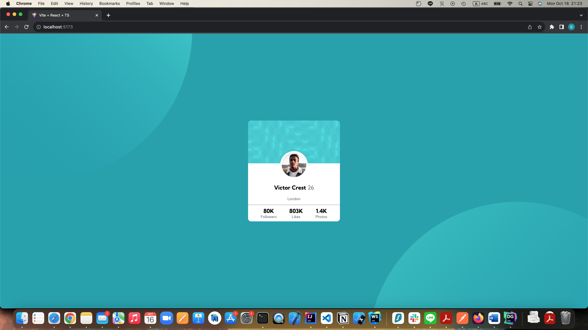
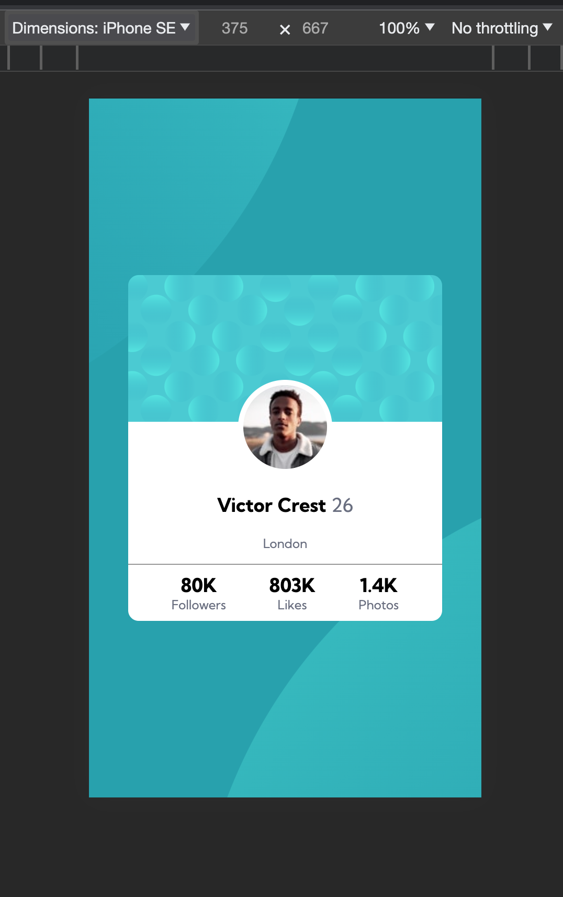

# Frontend Mentor - Profile card component solution

This is a solution to the [Profile card component challenge on Frontend Mentor](https://www.frontendmentor.io/challenges/profile-card-component-cfArpWshJ). Frontend Mentor challenges help you improve your coding skills by building realistic projects.

## Table of contents

- [Overview](#overview)
  - [The challenge](#the-challenge)
  - [Screenshot](#screenshot)
  - [Links](#links)
- [My process](#my-process)
  - [Built with](#built-with)
  - [What I learned](#what-i-learned)
- [Author](#author)

**Note: Delete this note and update the table of contents based on what sections you keep.**

## Overview

### The challenge

- Build out the project to the designs provided

### Screenshot

### Links

- Solution URL: [Add solution URL here](https://bejewelled-fudge-7aa1c8.netlify.app)
- Live Site URL: [Add live site URL here](https://bejewelled-fudge-7aa1c8.netlify.app)

## My process

### Built with

- CSS custom properties
- Flexbox
- Mobile-first workflow
- [React](https://reactjs.org/) - JS library
- Vite
- preprocessor - SCSS

### What I learned

I learnerd that I could use multiple images as my background. Also I leanred how to use/import google fonts

## Author

- Frontend Mentor - [@Bo-Kai Wang](https://www.frontendmentor.io/profile/BokaiWang)
